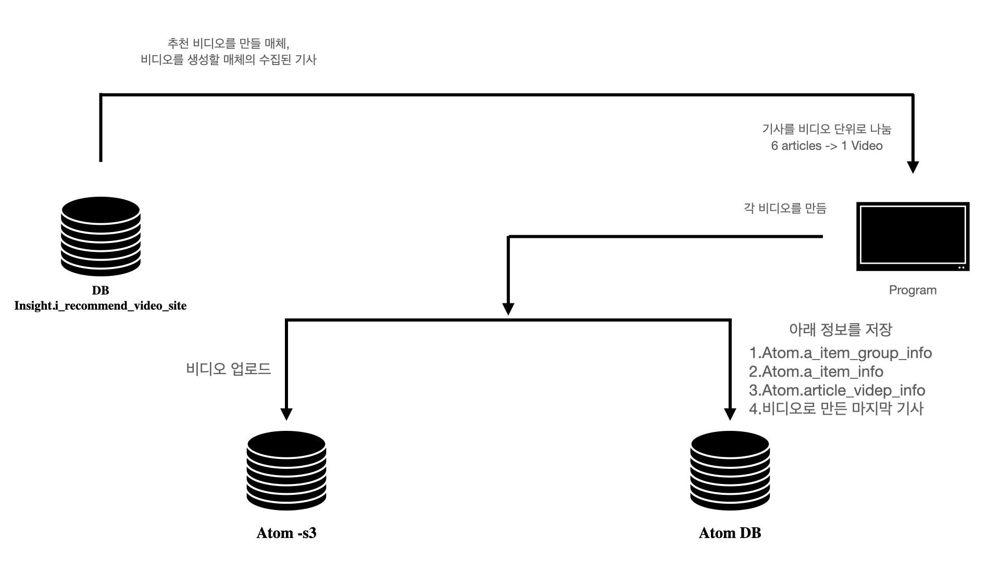
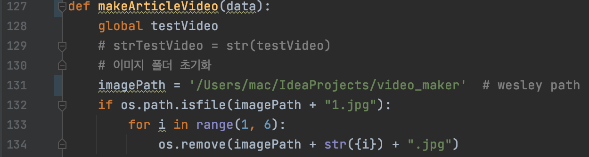
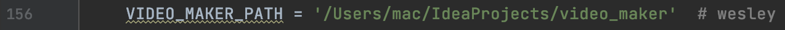

Video_Maker의 흐름
참고 : https://docs.google.com/document/d/1RTopSKgkTrbzTBSm4i0QUw9DI9TaIuvVP4ELjjzO364/edit

실행 방법
Intelli J 기준 우측 상단 -> Edit Configuration -> interpreter 설정 후 -> make.py 에서 ctrl + R (Run Shortcut)

make.py(131) 에서 본인의 경로에 맞게 수정해주어야한다. (이미지를 저장하기 위한 경로)

make.py(156) 에서 본인의 경로에 맞게 수정해주어야한다. (비디오를 저장하기 위한 경로)

